# x3d-cpp

[](https://github.com/delta9000/x3d-cpp/actions/workflows/ci.yml)
[](LICENSE)
[](https://en.cppreference.com/w/cpp/20)

A headless, renderer-agnostic **X3D domain-runtime SDK** in C++. Load an X3D
scene (XML, ClassicVRML, VRML97, or JSON), run its event / behavior model
tick-by-tick, and pull out renderer-ready geometry — meshes, materials, lights,
camera, background — for *your* backend. **No GPU, no windowing, no rendering
opinion**: the runtime stays spec-correct and backend-free, and you bring (or
borrow) the renderer.

**Versions:** parses X3D **3.0–4.1** documents; the generated node model targets
X3D **4.0**, so the six 4.1-only node types are not yet available (see
[Supported platforms & versions](#supported-platforms--versions)).

The C++ node layer is **generated from the official X3D Unified Object Model
(UOM)**: node and field declarations, types and defaults come from the UOM, and
behavioral conformance is tested separately. Generation substantially reduces
structural drift — it does not prove runtime semantics or eliminate UOM errata.

## Gallery — real X3D, rendered headless

Every image below is **real X3D**, parsed by the SDK and drawn by the
[headless CPU rasterizer example](examples/cpu_raster/) — **no GPU, no display,
no system dependencies** (image I/O is a vendored single-header stb, compiled
in). It consumes the same renderer-agnostic extraction seam any GL/Vulkan/CAVE
consumer would, which is the whole point: the runtime stays spec-correct and
backend-free.

| | |
|---|---|
| 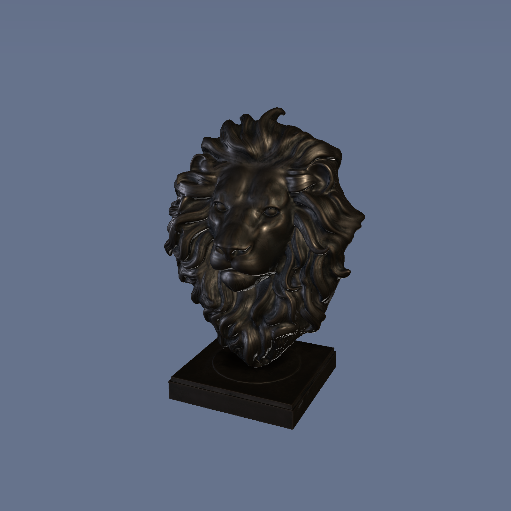 | 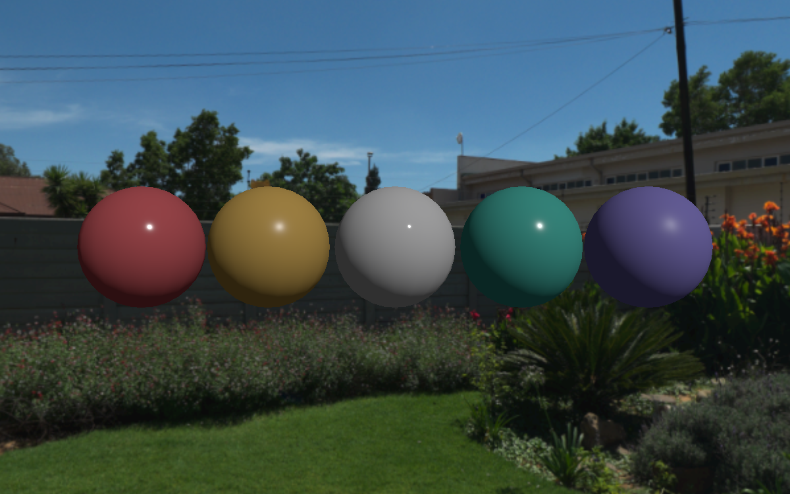 |
| A ~47k-triangle CC0 lion bust ([Poly Haven](https://polyhaven.com/a/lion_head)), textured PBR (base + ORM + normal map) under a three-point rig. | Glossy `PhysicalMaterial` spheres inside a `Background` panorama skybox. |
| 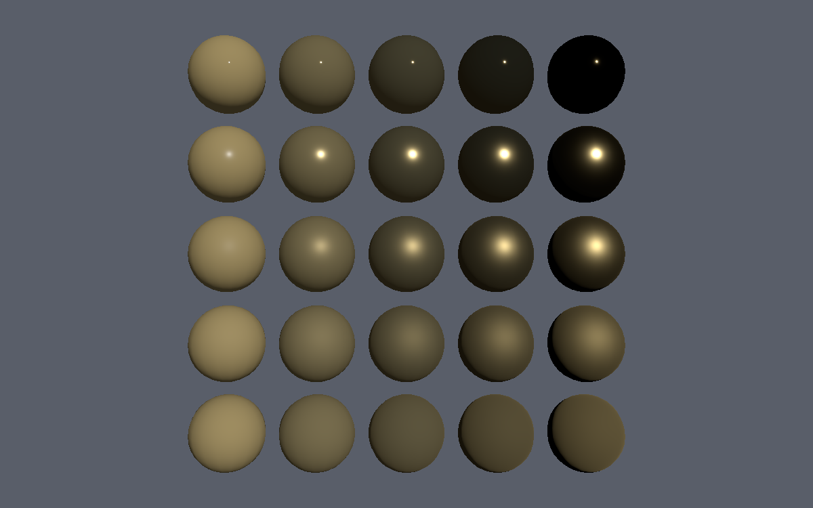 | 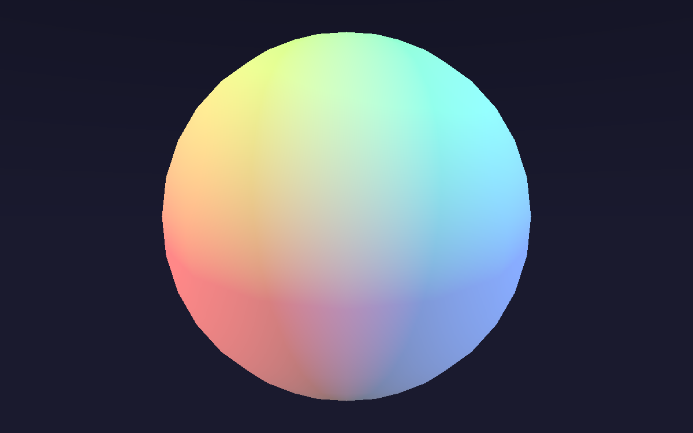 |
| Metallic × roughness sweep — the analytic Cook-Torrance/GGX BRDF. | RGB three-point directional lighting accumulating on a sphere. |

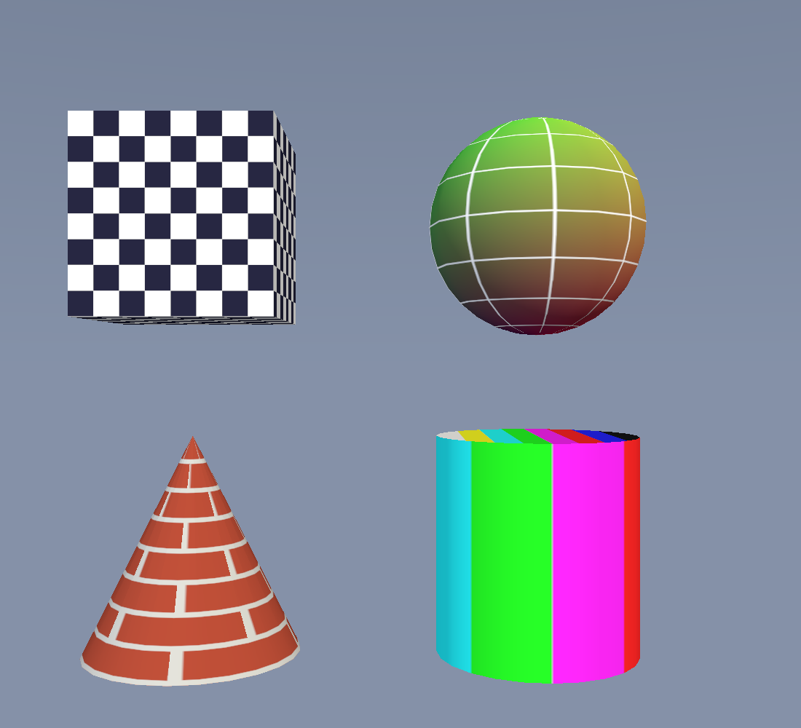

The analytic primitives (`Box`, `Sphere`, `Cone`, `Cylinder`), each wearing a
different `proc:` texture, so the per-primitive texture-coordinate generation
reads off the surface — checker on the box faces, lat/long on the sphere, brick
up the cone, rainbow bars around the cylinder.

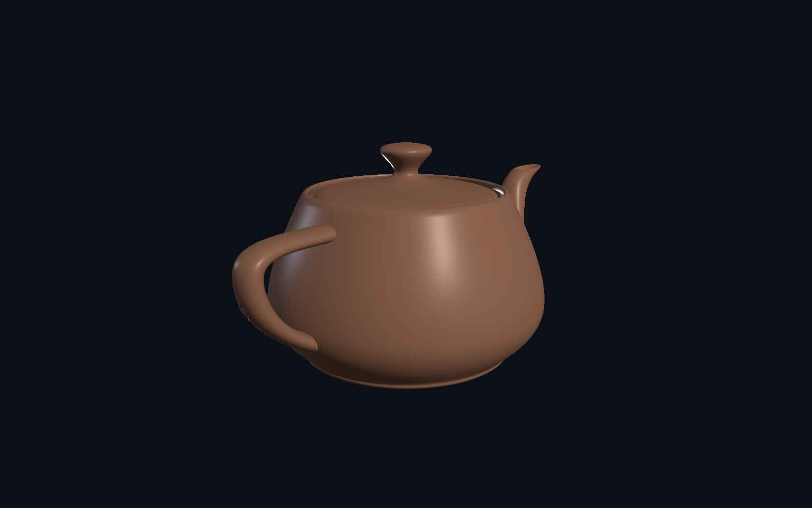

The **Utah teapot** (Martin Newell, 1975 — [public domain](http://www.holmes3d.net/graphics/teapot/)),
its 32 bicubic Bézier patches expressed as order-4 `NurbsPatchSurface` nodes — a Bézier
patch *is* a NURBS patch (clamped knots, unit weights). Tessellated with **analytic
normals** (the cross product of the surface partial derivatives), so the ceramic shading
runs smoothly across all 32 patch seams. Scene: `assets/gallery/hero_teapot_nurbs.x3d`.

Reproduce them with `mise run cpuraster`, then render any scene under
`examples/cpu_raster/assets/` (e.g. `… assets/models/lion_head/lion_head_lit.x3d -o lion.png`).

### Animated — interpolators over time

Seamless loops the **headless** CPU rasterizer produced by stepping simulation
time frame-by-frame (`--animate`) and muxing with ffmpeg — the same
`TimeSensor → Interpolator → ROUTE` machinery a browser runs, with no GPU or
display:

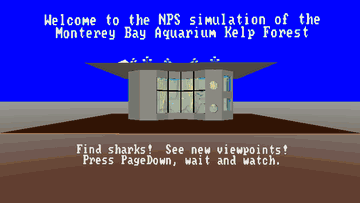

A guided-tour flythrough of a **real, 600+ item X3D world** — the NPS/MOVES
*Kelp Forest Exhibit* (Inline composition, PROTO fish & kelp, `ElevationGrid`
terrain, swimming/swaying/pumping animation) — rendered entirely headless.
Exhibit © NPS MOVES Institute (free use with credit); fetched, not bundled.
[Full-quality WebM](docs/videos/demos/kelp_flythrough.webm) ·
[how it's built](examples/cpu_raster/assets/kelp_flythrough/). And the synthetic
interpolator demos:

| | |
|---|---|
| 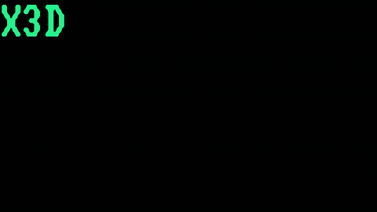 | 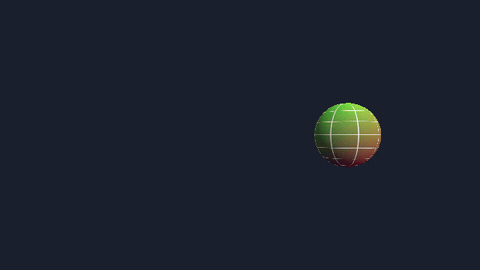 |
| The X3D "DVD logo": a `PositionInterpolator` with true edge reflections that grazes the corner without hitting it. | A textured sphere orbiting a closed path (`PositionInterpolator → Transform.translation`). |
| 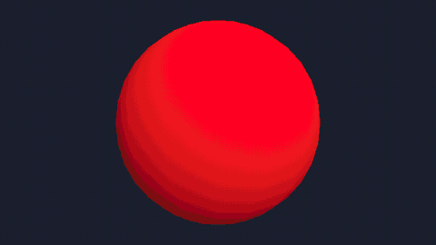 | 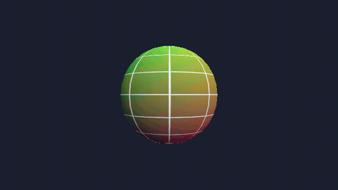 |
| A `ColorInterpolator` cycling a material through the HSV hue arc. | An `OrientationInterpolator` spinning a sphere via quaternion SLERP. |

Full-quality WebM:
[dvd](docs/videos/demos/dvd.webm) ·
[position](docs/videos/demos/position.webm) ·
[orientation](docs/videos/demos/orientation.webm) ·
[color](docs/videos/demos/color.webm) — regenerate everything with `mise run demos`; see
[`examples/cpu_raster/`](examples/cpu_raster/README.md#animation-demos).

## Supported platforms & versions

What is actually verified, as opposed to what might work. At 0.1 the honest
answer is **Linux is the gated tier; macOS (Apple Clang) and Windows (real MSVC)
are now compile- and test-verified for a core slice in CI, with the full behavior
suite compiling under both locally — but neither is yet a blocking merge gate**.

| Platform | Status |
|---|---|
| Linux x86-64, GCC 11+ | **Supported (gated)** — every push builds + tests here, also under ASan/UBSan |
| Linux x86-64, Clang 14+ | **Supported** — via the CI compiler matrix (run manually before releases, not per-push) plus the per-push Clang libFuzzer gate |
| macOS arm64, Apple Clang | **Compile + test verified (non-blocking).** The `cross-platform-smoke` CI job builds + `ctest`s the LoadSensor + FileResolver suites on `macos-latest`; the whole `x3d_behavior_tests` aggregate compiles locally. `continue-on-error`, so informational, not a gate. |
| Windows x64, MSVC | **Compile + test verified (non-blocking).** The same smoke job builds + `ctest`s those suites with **real MSVC** on `windows-latest`; the whole `x3d_behavior_tests` aggregate compiles + runs under real `cl.exe` locally via `mise run build-msvc-real` (msvc-wine) and the faster `mise run build-msvc` (clang-cl + xwin). `continue-on-error`. |

The per-PR `cross-platform-smoke` job (macOS + Windows) is non-blocking; the
heavier compiler matrix still varies the **compiler on Linux**, not the OS.
Promoting the smoke to a required gate over the full suite is the next step.
Local MSVC / Apple-Clang pre-flight — the fast way to catch portability drift
before pushing — is `mise run build-msvc` (clang-cl) and `mise run build-msvc-real`
(authoritative real cl.exe); see `cmake/toolchains/`.

**X3D versions.** Two axes, which are easy to conflate:

| Axis | Coverage |
|---|---|
| Parser (what loads) | X3D **3.0–4.1**, in all four encodings. Sub-3.0 VRML97/ClassicVRML is floored to 3.0; there is no upper gate, so a 4.2 document parses too. |
| Generated node model (what you get objects for) | X3D **4.0** — the UOM the bindings are generated from. |

So a 4.1 document parses and runs; the **six** node types 4.1 adds over 4.0 are
simply absent from the node layer: `EnvironmentLight`, `FontLibrary`,
`HAnimPose`, `InlineGeometry`, `RenderedTexture`, `Tangent`. See
[v1 capabilities](docs/sdk/v1-capabilities.md) for why (the generated tree is
under a byte-identical golden invariant, so a hand-authored 4.1 binding would
conflict with the gate) and [CONTRIBUTING](CONTRIBUTING.md) for the two-axis rule.

## Build and install

x3d-cpp is a normal CMake package. Nothing project-specific is needed to build,
install, or consume it:

```bash
cmake -S . -B build -G Ninja \
  -DCMAKE_BUILD_TYPE=Release \
  -DX3D_CPP_BUILD_TESTS=OFF
cmake --build build
cmake --install build --prefix "$PWD/install"
```

Without `-DCMAKE_BUILD_TYPE=Release`, single-config generators build with no
optimization and the install prefix roughly triples (measured 79 MB vs 27 MB).
Use `RelWithDebInfo` if you want symbols.

Then consume it from a downstream project:

```bash
cmake -S . -B build -DCMAKE_PREFIX_PATH=/path/to/install
```

```cmake
find_package(x3d_cpp CONFIG REQUIRED)
target_link_libraries(my_app PRIVATE x3d_cpp::sdk)
```

[`examples/embed_minimal/`](examples/embed_minimal/) is exactly this: a
downstream-style project that does not depend on the source tree.
`scripts/verify_install_embed.sh` builds it against a throwaway install prefix
in CI (the ctest `x3d_install_embed_smoke`, run by every C++-touching PR and
every push), so the sequence above is gate-enforced rather than aspirational.

**Requires:** a C++20 compiler and CMake 3.21+. Contributors additionally use
[mise](#dev-tasks-mise) as a task runner — see [Dev tasks](#dev-tasks-mise).

## Quickstart — three ways in

### 1. The `x3d` CLI (no code)

Build the CLI (`cmake --build build` → `build/x3d`, or `mise run build`), then
drive scenes from the shell — convert between encodings, validate against the
spec, headlessly simulate behavior, or export geometry:

```bash
x3d convert  scene.x3dv -o scene.x3d -f xml   # ClassicVRML → XML (or vrml|json)
x3d validate scene.x3d  --json                # conformance + profile-fit diagnostics
x3d sim      scene.x3d  --ticks 120           # run the event/behavior loop, trace field changes
x3d extract  scene.x3d  -o scene.stl          # geometry → binary STL
x3d canonicalize scene.x3d                     # X3D Canonical Form (X3DC14N)
```

### 2. Embed the SDK (one header)

Link `x3d_cpp::sdk` and `#include "x3d/sdk.hpp"` — everything an embedder needs
is in namespace `x3d::sdk`. Parse once, tick each frame, consume the delta.
`RuntimeSession` is the recommended entry point: it owns the document, context,
and extractor, and does the setup wiring you can silently forget (skip
`attachStandardRuntime` on the manual path, for example, and ROUTEs resolve but
nothing drives them — the scene renders one static frame forever):

```cpp
#include "x3d/sdk.hpp"
namespace sdk = x3d::sdk;

auto session = sdk::RuntimeSession::create(sdk::parseFile("scene.x3d"));  // 4 encodings + gzip
sdk::RenderDelta f0 = session->fullSnapshot();        // upload f0.added (meshes/materials/lights)
const auto t0 = std::chrono::steady_clock::now();     // monotonic clock start
while (running) {
  double now = std::chrono::duration<double>(std::chrono::steady_clock::now() - t0).count();  // seconds since start
  session->tick(now);                                 // advance time, routes, scripts, behaviors
  sdk::RenderDelta d = session->delta();              // apply d.added / removed / updated*
}
```

This is a shorter path, not a walled garden: `session->context()` /
`extractor()` / `scene()` hand back the underlying `X3DExecutionContext`,
`SceneExtractor`, and scene, and the low-level surface stays public
(`SessionOptions` names what `create` turns on).

The simulation and extraction core performs no hidden resource, network, image,
font, media or rendering I/O — those are embedder-supplied **seams**: *ports* in
the ports-and-adapters sense, where the core owns the interface and you supply
the backend (`AssetResolver`, `TextureResolver`, `FontMetrics`, `ScriptEngine`,
…), each proven swappable by a second backend. `parseFile()` above is a
synchronous local-file convenience API — the one deliberate exception. See
[`docs/sdk/`](docs/sdk/).

For a downstream-style CMake project that does not depend on the source tree,
see [`examples/embed_minimal/`](examples/embed_minimal/). It uses only:

```cmake
find_package(x3d_cpp CONFIG REQUIRED)
target_link_libraries(my_app PRIVATE x3d_cpp::sdk)
```

### 3. Render it headless (the gallery above)

The [`examples/cpu_raster/`](examples/cpu_raster/) reference consumer turns the
extraction output into a PNG on the CPU — no GPU, no display — which is exactly
how the gallery shots are made:

```bash
mise run cpuraster   # build + test the rasterizer (build-cpuraster/)
build-cpuraster/examples/cpu_raster/x3d_cpu_raster scene.x3d -o scene.png
```

## Generating the C++ bindings

The node layer is regenerated from the X3D UOM (build-time codegen, not needed
to *use* the SDK):

```bash
uv run x3d-cpp-gen --out ./generated_cpp_bindings
```

Runs from any working directory; the spec XML and Jinja templates ship with the
package and are resolved relative to the install, not the CWD.

### Options

- `-s, --spec` — path to the X3D UOM XML (default: packaged 4.0 model)
- `-o, --out` — output directory (default: `./generated_cpp_bindings`)
- `--templates` — Jinja templates directory (default: packaged)
- `--clang-format` — formatter executable (env `CLANG_FORMAT`; empty to disable)
- `--compiler` — C++ compiler for the smoke test (env `CXX`; an empty value is
  an error, not a skip — use `--no-test` to skip deliberately)
- `--no-test` — skip generating/compiling the smoke test
- `--allow-unsupported-fields` — don't fail when the UOM contains a field type
  the generator doesn't support (default: fail closed)

The generated smoke test (`generated_cpp_bindings/test.cpp`) is value-asserting:
for every concrete node it default-constructs an instance and asserts each
readable field with a spec default returns exactly that default (comparing the
field getter against the node's static `getDefault<Name>()`), plus explicit
literal pins for a few well-known nodes (e.g. `Box` size=={2,2,2}, solid==true).
`uv run x3d-cpp-gen` compiles and runs it.

## Dev tasks (mise)

The repo ships a `mise.toml` task runner:

```bash
mise run gen           # regenerate the committed C++ bindings into generated_cpp_bindings/
mise run test          # pytest (unit suite + full-tree golden-drift test)
mise run golden        # golden-drift gate (regenerate to a temp dir, diff every *.hpp/*.cpp)
mise run build         # cmake configure + build + ctest
mise run corpus-fetch  # fetch the X3D test corpus the differential gates need (see "Test corpus")
mise run ci            # full local pipeline: test + golden + conformance-gate + build +
                       #   cli-gate-regression (the last needs a corpus — run corpus-fetch first)
```

(`scripts/check_golden.sh` is the same golden gate, runnable directly.)

## Golden-file policy

`generated_cpp_bindings/` is **golden**: every generated `*.hpp` and `*.cpp` is
committed and treated as the source of truth for codegen output. The only
generation artifacts that are NOT golden are `test.cpp` / `test_exec` (gitignored).

Codegen changes are therefore **intentional and explicit**:

1. Change a template (`src/x3d_cpp_gen/templates/`) or emitter.
2. Regenerate: `uv run x3d-cpp-gen --out generated_cpp_bindings` (or `mise run gen`).
3. Review and **commit** the new generated sources.

The golden-drift gate (`scripts/check_golden.sh`, `tests/test_golden_tree.py`,
and the `golden` CI job) regenerates into a temp dir and fails on ANY difference
in the generated `*.hpp`/`*.cpp` tree, so uncommitted codegen drift can never
land silently.

## CI

`.github/workflows/ci.yml` runs the fast, hermetic gates on every pull request
(pytest, golden drift, conformance-view drift, wiki strict build, and a
single-compiler C++ build + ctest). The heavy 4-compiler baseline matrix stays
manual (`workflow_dispatch`). Forgejo Actions reads the same file if the repo is
mirrored there:

- **python** — `uv sync` + `uv run pytest` (unit suite + full-tree golden test).
- **golden** — the golden-drift gate (regenerate + diff).
- **cpp** — `cmake` build + `ctest` with the distro GCC on every PR; the
  manual **cpp-matrix** job additionally pins the **baseline GCC 11 / Clang 14**
  and runs the current distro compilers.

## Configuration (optional external resources)

The SDK and its generator build and test with **no external data** — the
generated bindings and the X3D Unified Object Model are bundled, so **nothing
here is required to build, test, or use the SDK** (`mise run test` / `golden` /
`build` need none of it). A few *optional* developer tools and conformance gates
plug in via environment variables. The RAG and JDK seams skip cleanly when
unset; the **corpus differential gates** instead *fail-closed* when asked to run
without a corpus (a gate with no inputs must never green) — fetch one in seconds
with `mise run corpus-fetch` (see [Test corpus](#test-corpus)):

| Variable | Used by | What plugs in |
|----------|---------|---------------|
| `X3D_CORPUS_DIR` | corpus sweep, CLI/canon gates (`mise run corpus` / `cli-gate` / `canon-gate`) | Root of a local [X3D example archive](https://www.web3d.org/x3d/content/examples/) checkout. Defaults to `.x3d-corpus/` populated by `mise run corpus-fetch` — see [Test corpus](#test-corpus). |
| `X3D_SPEC_PROSE_DIR` | `scripts/spec_rag.py` | Directory of X3D normative-prose markdown (one `*.md` per section, mirrored from web3d.org). |
| `X3D_EMBED_URL` | `scripts/spec_rag.py`, `scripts/code_rag.py` | OpenAI-compatible embeddings endpoint (`POST {"model","input"}` → `{"data":[{"embedding":[…]}]}`). Default `http://localhost:8080/v1/embeddings`. |
| `X3D_QDRANT_URL` | the RAG scripts | Base URL of a [Qdrant](https://qdrant.tech/) vector store. Default `http://localhost:6333`. |
| `X3D_JDK_BIN` / `JAVA_HOME` | `tools/x3d-cli/gen_canon_goldens.sh` | A JDK ≥ 25 (X3DJSAIL `-canonical` needs it). Auto-discovered via `JAVA_HOME` / `mise` / `PATH` if unset. |

## Test corpus

The differential gates (`mise run cli-gate` / `canon-gate` / `cli-gate-regression`)
and the full sweep (`mise run corpus`) validate the SDK against the **Web3D X3D
Example Archive**. None of this is needed to build, test, or use the SDK — only
to run those gates.

Get it with one command:

```bash
mise run corpus-fetch          # ~9 MB, a few seconds
mise run cli-gate-regression   # now PASS (was fail-closed with no corpus)
```

`corpus-fetch` (`scripts/fetch_corpus.sh`) downloads exactly what the gates need
— the committed curated subset (`tools/x3d-cli/goldens/subset.txt`) **plus its
transitive `Inline`/`EXTERNPROTO` scene dependencies** — into the layout the
gates expect:

```
.x3d-corpus/x3d-code/www.web3d.org/x3d/content/examples/...
```

It lands in `.x3d-corpus/` (gitignored) by default, which the gate tasks pick up
automatically; set `X3D_CORPUS_DIR` to use a different location (e.g. a full
archive checkout). Notes:

- **Subset vs. dependencies.** `subset.txt` lists the files to *test*; validating
  them needs the scenes they pull in via `Inline`/`EXTERNPROTO`, so the fetcher
  resolves that closure. A bare subset would produce false "regressions".
- **A few subset entries may be unavailable** upstream (pruned since the subset
  was committed); the gates tolerate this and the fetcher reports which.
- **Authoritative source.** Master is the Web3D `x3d` SourceForge **SVN** repo
  (`svn.code.sf.net/p/x3d/code`); `corpus-fetch` pulls the same files over HTTP
  from `www.web3d.org`. For a full, version-pinned archive, `svn checkout` that
  repo into `$X3D_CORPUS_DIR/x3d-code/`.
- **License.** The example scenes are open-source under the BSD-style *Web3D
  Consortium Open-Source License for Models and Software* (each carries
  `<meta name='license' content='../license.html'/>`). The fetcher downloads
  from the source and never redistributes them, so they are not bundled here.

## License

[MIT](LICENSE) © 2026 Ben Sandbrook. Bundled and optional third-party
components (including the Web3D Consortium X3D Unified Object Model, under a
BSD-style license) are credited in [NOTICE](NOTICE).
