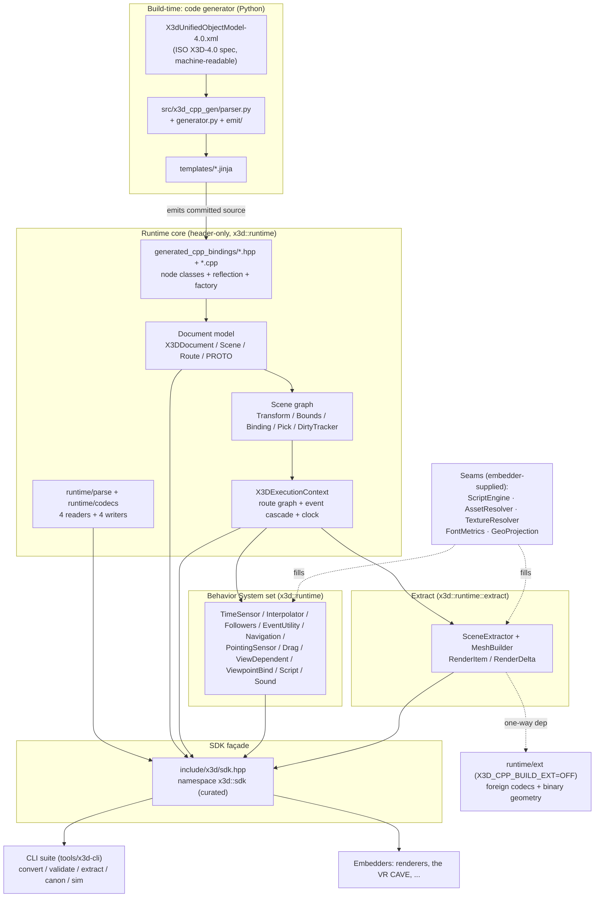

# Architecture

This is the system map: the layered spine that every other wiki page hangs off. x3d-cpp is a headless, renderer-agnostic X3D-4.0 domain runtime SDK. It parses any of the four X3D encodings into a document model, runs the event/behavior cascade over a live scene graph, and extracts renderer-ready descriptors. Beyond the parse path's own local-file reads (`parseFile`), it performs no hidden resource, network, image, font, media or rendering I/O, and no rasterization. Those responsibilities live behind explicit seams that the embedder fills.

The cardinal design rule: **the node model is the single source of truth**. Every runtime subsystem keeps its state in side tables keyed by `const X3DNode*` or dense ids, never by mutating node state. That is what lets the same scene be reflected, ticked, extracted, and re-serialized byte-identically (the golden gate).

## The layers, top to bottom



### 1. The generator (build-time, Python)

The C++ node bindings are not hand-written — they are generated from the machine-readable ISO spec. The generator reads the X3D Unified Object Model (`src/x3d_cpp_gen/data/X3dUnifiedObjectModel-4.0.xml`), parses it into a node/field/inheritance model (`src/x3d_cpp_gen/parser.py`, `generator.py`, `emit/`), and renders Jinja templates (`src/x3d_cpp_gen/templates/class_template.{hpp,cpp}.jinja`) into committed C++ source. Run it with `mise run gen` (`uv run x3d-cpp-gen --out generated_cpp_bindings`). Because the output is committed, the **golden gate** (`mise run golden`) regenerates to a temp dir and diffs — any spec or template change that drifts the output fails CI. See [Gate System](guides/gate-system.md).

### 2. generated_cpp_bindings — the compiled node layer

The emitted `*.hpp` are the X3D node classes (each `X3DNode` subclass with typed fields, reflection via `fields()`, get/set, DEF handling) plus the `X3DNodeFactory` registry. The emitted `*.cpp` carry the out-of-line reflection/validate definitions. These `.cpp` are compiled **once** into a static library `x3d_cpp_nodes` (alias `x3d_cpp::nodes`, `CMakeLists.txt`). This is the C1 decl/def split (2026-06-16): before it, the reflection thunks were re-instantiated in every consumer TU and cold builds took ~1296s and OOM-killed `cc1plus` above `-j4`; after it, cold build dropped to ~76s (~17×) and per-compile peak RSS fell to ~0.86 GB. Consumers link the header interface `x3d_cpp` (an `INTERFACE` target) which transitively pulls in the compiled definitions.

### 3. Runtime core — document model + scene graph + execution context

All header-only, in `x3d::runtime`. Three sub-layers:

- **Document model** (`runtime/X3DDocument.hpp`, `X3DScene.hpp`, `X3DRoute.hpp`, `X3DProto.hpp`, imports/exports): the parsed shape of a file — `Scene { rootNodes, defs, routes, protoDeclarations, ... }`, `Head`, `Profile`, `Route` (DEF-name strings).
- **Codecs** (`runtime/parse/`, `runtime/codecs/`): four readers (XML, ClassicVRML, VRML97, JSON; gzip-aware; lenient/range-tolerant) and four reflection-driven writers (`XmlWriter`, `JsonWriter`, `VrmlWriter`, `CanonicalXmlWriter`). The same reflection that the writers walk is what makes serialization deterministic and round-trippable.
- **Scene graph** (`runtime/scene/`): `TransformSystem` (local→world), `BoundsSystem` (AABB), `BindingSystem` (bindable stacks), `PickSystem` (ray pick), and `DirtyTracker` (per-tick change set). `CycleBreaker` severs containment cycles to a DAG once at `buildSceneGraph` so the recursive walkers cannot stack-overflow on malformed `<X DEF='a' USE='a'/>`.

The keystone is **`X3DExecutionContext`** (`runtime/events/X3DExecutionContext.hpp`). It owns the route graph and a single long-lived event cascade. Setup order (the embedder/SDK contract):

1. `ctx.buildSceneGraph(scene)` — break cycles, index transforms, build bounds, enroll bindables/pick.
2. `ctx.buildFrom(scene)` — resolve DEF-named ROUTEs and PROTO `IS` redirects onto the live graph (returns a `BridgeResult` of routes added + rejected-with-reason).
3. `ctx.addSystem(...)` / `ctx.addScriptSystem(...)` — register behaviors before the first tick.

Then each frame: set inputs, `ctx.tick(now)`, read the pull surface (`dirtyTracker()`, `worldTransform()`, ...). `tick()` opens one timestamp, calls every System's `update`, drains the cascade to quiescence (events posted mid-drain are processed in the same frame, per §4.4.8.3), runs Script `eventsProcessed()` hooks, then propagates dirtied transforms and bounds.

### 4. The behavior System set

A `System` (`runtime/events/X3DSystem.hpp`) is a behavior family over a collection of nodes of one kind — the unit a browser registers via `addSystem`. Two styles share one base: **time-driven** systems (TimeSensor) act in `update(now, ctx)`; **event-driven** systems (the interpolator family) wire an inputOnly handler in `attach(node, ctx)` and leave `update` a no-op. The shipped set includes TimeSensor, Interpolator/SplineInterpolator, [Followers](subsystems/system-followers.md) (§39 Damper + Chaser smoothing across all 14 follower node types), [EventUtility](subsystems/system-eventutility.md) (§30 triggers/filters/toggles/sequencers for logic without scripting), Navigation (EXAMINE/FLY/LOOKAT), PointingSensor + Drag sensors (Plane/Sphere/Cylinder), [ViewDependent](subsystems/system-viewdependent.md) (LOD `level_changed` + ProximitySensor/VisibilitySensor/TransformSensor edges + Billboard view-facing), KeyDeviceSensor, ViewpointBind, the Script system, a [Physics](subsystems/physics.md) system (§37 RigidBody dynamics via a Jolt backend, behind the `X3D_CPP_BUILD_PHYSICS` flag), and a [Sound](subsystems/sound.md) system (§16 audio graph via an engine-agnostic `AudioBackend` seam + a dependency-free `BuiltinDspBackend` — always built, no flag needed). They live alongside the cascade in `runtime/events/` (view-dependent in `runtime/scene/`, physics in `runtime/physics/`, sound in `runtime/sound/`).

### 5. Extract — SceneExtractor + MeshBuilder

`runtime/extract/` (`x3d::runtime::extract`). `SceneExtractor` walks the live graph (a visibility-aware DFS that special-cases `Switch`/`LOD` before the generic child loop, accumulating world matrices fresh down each path) and produces renderer-ready descriptors: `RenderItem` (path + world transform + geometry + material + mesh + lights), plus `MaterialDesc`, `LightDesc`, `CameraDesc`, `BackgroundDesc`. `MeshBuilder` tessellates geometry into `MeshData` (positions/indices/normals/texcoords/colors/topology). The first call is `fullSnapshot()`; subsequent frames call `delta()` — reverse indices (transform/geom/material deps + an entry-matrix cache built during the DFS) resolve a changed node to its affected `RenderItemId`s incrementally. Identity is per-path; geometry/material are content/node-keyed and legitimately shared across `USE` placements. All caches are side tables keyed by `const X3DNode*`/dense id — **zero node state**.

### 6. The SDK façade — `x3d::sdk`

`include/x3d/sdk.hpp` (CMake target `x3d_cpp::sdk`, a thin `INTERFACE` target adding the `include/` path — no new compiled TU; it only re-exports). One header gives the embedder the whole curated surface in `namespace x3d::sdk`: loading (`parseFile`/`parseDocument`/writers), the execution context (`X3DExecutionContext`, `System`, `DirtyTracker`), extraction (`SceneExtractor`, `RenderItem`, `RenderDelta`), and the seams. Symbols are tagged `[STABLE]` (frozen pre-v2) or `[EXPERIMENTAL]` (shape may evolve). Internals are intentionally not pulled in.

### 7. The CLI suite — first SDK consumer

`tools/x3d-cli` is the first real `x3d::sdk` consumer: `x3d <subcommand>` — `convert` (cross-encoding), `validate`, `extract`, `canonical`, `sim`. It doubles as the SDK's exercise harness and feeds the differential regression gates (X3DJSAIL diff, convert round-trip, canonical-form). See [CLI Suite](subsystems/cli-suite.md).

## The seams (the renderer-agnostic boundary)

Beyond the parse path's own local-file reads (`parseFile`), the SDK performs no hidden resource or network I/O, no image/movie decoding, no font rasterization, no geodesy, and no scripting-language embedding. Each is a typed seam the embedder fills. This is what makes the runtime renderer-agnostic.

| Seam | Type / header | What the embedder supplies |
|---|---|---|
| **ScriptEngine → Duktape** | `runtime/script/ScriptEngine.hpp` (abstract) | A language backend. The shipped one is `EcmaScriptBackend` (Duktape, `runtime/script/`). The seam carries **no scripting-language types** — every value crossing it is the runtime's own field representation (`std::any` tagged by `X3DFieldType`), so a Lua/Java/Python backend slots in identically. Register via `ScriptSystem` + `ctx.addScriptSystem(...)`; `SaiContext` is the backend↔runtime channel. |
| **AssetResolver** | `runtime/extract/AssetResolver.hpp` — `function<AssetResult(url, AssetKind)>` | URL→bytes. One type, two contracts: render-time may return `Pending` (retry next frame); parse-time (Inline/ExternProto) must answer `Ready`/`Failed` synchronously. `AssetKind` ∈ {Texture, Movie, Inline, ExternProto, ExternalGeometry}. |
| **TextureResolver** | `runtime/extract/TextureResolver.hpp` — `function<TexturePixelResult(url)>` | url→decoded RGBA pixels; the SDK threads the result onto `TextureRef` so a consumer binds without re-resolving. |
| **FontMetrics** | `runtime/extract/FontMetrics.hpp` — `function<GlyphResult(const FontKey&)>` | Per-codepoint advance + optional atlas UV/outline; the SDK does all `Text` layout. Default = `makeMonospaceStub` (advanceEm 0.6). |
| **GeoProjection** | `runtime/extract/MeshBuilder.hpp` — `function<SFVec3f(SFVec3d geoCoord, double elev, GeoSystemDesc)>` | Geodetic→Cartesian. Supplied via `MeshBuildOptions::geoProjection`; empty ⇒ flat fallback. |

### The ext firewall — a one-way dependency, not a seam

Foreign-format codecs and binary-geometry helpers live in `runtime/ext/` (`x3d::runtime::ext`) behind the CMake option `X3D_CPP_BUILD_EXT` (default **OFF**, `CMakeLists.txt`). The dependency is strictly one-way: ext may include `runtime/extract/*` (PackedMesh, Aabb, ...), but **core never includes `runtime/ext/*`**. With the flag off, the standard build / golden / ctest path is completely unaffected. This keeps the core spec-clean while allowing non-spec import paths (e.g. binary mesh) to exist out of band. See [ADR-0001: Ext Firewall](decisions/0001-ext-firewall.md).

## Data flow, end to end

```
file (xml/x3dv/wrl/json, maybe gzip)
  │  runtime/parse  →  X3DDocument { version, profile, head, scene, rangeWarnings, protoWarnings }
  ▼
X3DExecutionContext
  ├─ buildSceneGraph(scene)   index transforms/bounds/bindings/pick; break cycles
  └─ buildFrom(scene)         resolve DEF-named ROUTEs + PROTO IS redirects  → BridgeResult
  │
  ▼  per frame:
set inputs (pointer/key/headpose)  →  ctx.tick(now)
        ├─ Systems.update(now)        TimeSensor, Interpolator, Followers, EventUtility, Nav, Sensors, ViewDependent, Script
        ├─ cascade.process()          drain ROUTEs to quiescence (same-frame)
        ├─ Script eventsProcessed()   post-cascade hooks
        └─ propagate dirty             local→world transforms, geometry→bounds
  │
  ▼
SceneExtractor.fullSnapshot()  → RenderDelta (added)         } consumer uploads / applies
SceneExtractor.delta()         → RenderDelta (changed sets)  }   (renderer, the VR CAVE, …)

       and/or  →  writers (Xml/Json/Vrml/CanonicalXml)  →  serialize back to any encoding
```

The two terminal consumers of the runtime are (a) the **extract** path that feeds a renderer with `RenderItem`/`RenderDelta`, and (b) the **writer** path that re-serializes the (possibly mutated) document to any of the four encodings — the byte-identical round-trip locked by the golden and canonical gates.

## Where to go next

- [CLI Suite](subsystems/cli-suite.md) — the first SDK consumer and gate harness.
- [ADR-0001: Ext Firewall](decisions/0001-ext-firewall.md) — the one-way `X3D_CPP_BUILD_EXT` boundary.
- [Gate System](guides/gate-system.md) — golden / conformance / cli regression gates.
- [Knowledge Map](knowledge-map.md) and [Coverage](coverage.md) for the wider page index, and the wiki [home](index.md).
