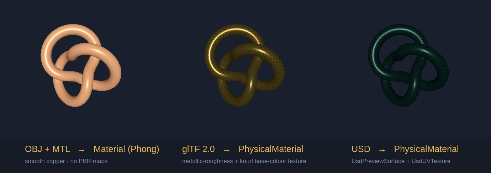
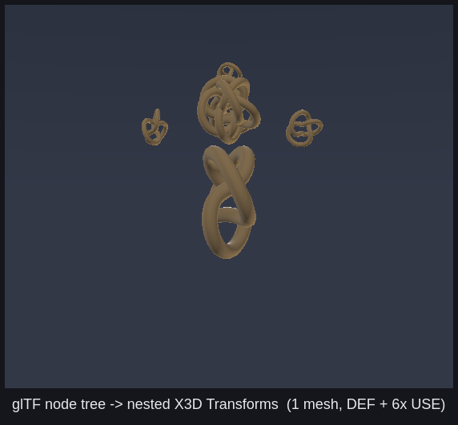

# Conversion showcase — OBJ · glTF · USD → X3D

One (2,3) torus knot (~6.7k verts / 13.4k tris, smooth-shaded, UV-mapped), authored
in three source formats, run through `x3d_asset_import` to show that a single
converter + material pipeline handles all three backends and maps each to the right
X3D 4.0 material node.



| Source | Backend | Material | X3D node |
|---|---|---|---|
| `knot.obj` + `knot.mtl` | assimp (`-DX3D_CPP_BUILD_ASSIMP=ON`) | copper `Kd`/`Ks`, untextured | `Material` (Phong) |
| `knot.gltf` (self-contained, embedded buffer + texture) | assimp | gold metallic-roughness + `baseColorTexture` | `PhysicalMaterial` |
| `knot.usda` | tinyusdz (`-DX3D_CPP_BUILD_USD=ON`) | teal `UsdPreviewSurface` + `UsdUVTexture` diffuse | `PhysicalMaterial` |

OBJ carries no PBR, so it imports as a smooth Phong `Material`; glTF and USD both
carry metallic-roughness **plus a base-colour texture**, map to `PhysicalMaterial`,
and exercise the full texture pipeline (extract → re-encode PNG → emit `url` → the
CPU rasterizer samples it). The metallic knurl detail and specular highlight in the
gold/teal knots — versus the flat copper — are the visible PBR difference. (The CPU
rasterizer is headlight-lit with no image-based lighting, so metals are kept at a
moderate `metallic ≈ 0.45` where the specular response reads without going near-black.)

## License

Everything is generated procedurally by [`gen.py`](gen.py) — the mesh (a parametric
torus knot with rotation-minimizing frames) and the knurl base-colour textures (a
stdlib PNG writer, no PIL) — so there are no third-party models or images and the
showcase is free of asset-licensing constraints (see the
[asset-licensing policy](../../README.md#example-models--licensing)). The generated
`knot.*` sources and `knot_gold.png` / `knot_teal.png` textures are `.gitignore`d
(regenerable; not vendored, to keep the repo lean).

## Regenerate + convert + render

```sh
cd examples/asset_import/assets/showcase && python3 gen.py   # writes knot.obj/.mtl/.gltf/.usda
cd -

BIN=build-asset-import/examples/asset_import/x3d_asset_import   # built with ASSIMP + USD ON
for fmt in obj gltf usda; do
  "$BIN" examples/asset_import/assets/showcase/knot.$fmt -o /tmp/knot_$fmt.x3d --stats
done

# visualize (headless CPU rasterizer)
build-cpuraster/examples/cpu_raster/x3d_cpu_raster /tmp/knot_gltf.x3d -o /tmp/knot.ppm
```

The montage above was composited from three such renders under one three-point rig.

## Hierarchy

[`gen_hier.py`](gen_hier.py) authors a **nested transform tree** with a distinct
primitive per level — **box hub → 3 sphere arms → 3 cone moons** — in glTF and USD,
to show the converter preserves the scene graph. A different shape (and colour) at
each depth makes the parent → child → grandchild nesting read at a glance. OBJ is
omitted: the format has no node transforms or parenting.



The tree is built so the rotation at each spoke actually *moves* its subtree: the
translate lives on a **child** of the rotating pivot, not the pivot itself (otherwise
a rotation just spins a shape in place). Each cone therefore inherits
`box ← spoke-fan ← sphere-offset` before its own offset, so the moons pointing
radially outward are the visible proof the inherited transforms survived the
round-trip.

The emitted X3D mirrors the source tree as nested `<Transform>`s (four levels deep),
and the sphere and cone — each reused three times — become one `DEF` + two `USE`
references (instancing) rather than duplicated geometry:

```xml
<Transform>                                     <!-- box hub (root) -->
  <Shape DEF="BoxMesh"/>
  <Transform rotation="0 0 1 1.571">            <!-- spoke pivot @ 90° -->
    <Transform translation="3.4 0 0">           <!-- sphere arm -->
      <Shape DEF="SphereMesh"/>
      <Transform translation="2.15 0 0" rotation="0 0 1 -1.571">  <!-- cone moon -->
        <Shape DEF="ConeMesh"/>
      </Transform>
    </Transform>
  </Transform>
  <Transform rotation="0 0 1 3.665"> … <Shape USE="SphereMesh"/> … <Shape USE="ConeMesh"/> … </Transform>
  <Transform rotation="0 0 1 5.760"> … <Shape USE="SphereMesh"/> … <Shape USE="ConeMesh"/> … </Transform>
</Transform>
```

(DEF names above are illustrative; the converter numbers them `Mesh0…N`.)

```sh
python3 gen_hier.py                       # writes scene.gltf + scene.usda
"$BIN" examples/asset_import/assets/showcase/scene.gltf -o /tmp/hier.x3d --stats
```
